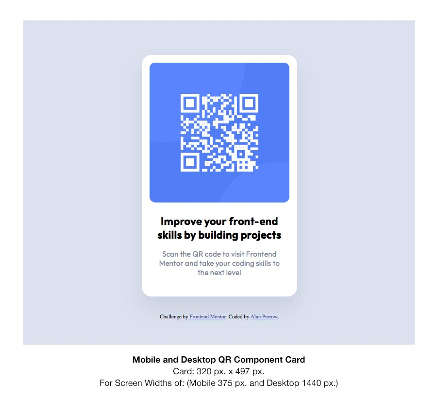

# Frontend Mentor - QR code component solution

This is a solution to the [QR code component challenge on Frontend Mentor](https://www.frontendmentor.io/challenges/qr-code-component-iux_sIO_H). Frontend Mentor challenges help you improve your coding skills by building realistic projects. 

## Table of contents

- [Overview](#overview)
  - [Screenshot](#screenshot)
  - [Links](#links)
- [My process](#my-process)
  - [Built with](#built-with)
  - [What I learned](#what-i-learned)
  - [Continued development](#continued-development)
  - [Useful resources](#useful-resources)
- [Author](#author)
- [Acknowledgments](#acknowledgments)


## Overview

### The challenge

Users should be able to:

- Build out this QR Code Component Challenge to match the include JPG reference images, one for mobile (375 px.) and the other for desktop (1440 px.). The Card itself is the same size for in both views; so, adjusting its size to fit the two views isn't necessary.

### Screenshot



The screenshot above represent the solution as viewed in the Safari web browser on the Mac at 100%.

### Links

- Solution URL: [Code Code Component Card Challenge](https://stosh12.github.io/qr-code-component/)
- Live Site URL: [Code Code Component Card Challenge](https://stosh12.github.io/qr-code-component/)

## My process

I followed pretty closely the readme instructions that originally came with this challenge. I began with coding the HTML first mostly and then added my styles in a separate CSS file. As things became a little more challenging and problem solving was needed, I would switch back and forth between both.

I started with the mobile view first and then worked forwards to the desktop view. To keep images, graphics and text aligned as best as I could, I used a screened back template image of the design mockup placed within the main card holder div. This way, I could adjust margins, text, images and border sizes to get a solution that was almost right on to the design mockups, which were provided.

I used VSCode as my coding application of choice with its "Live Server" extension and previewed my layout within Apple's Safari web browser on the Mac and then later tested it within the Chrome web browser on the Mac, as well. Both rendered the same results. While coding, semantic HTML5 markup was used as best as one could on this project. Since, it was a card only, the main semantic elements that were used were the "section," header," and the "h1" tags.


### Built with

- Semantic HTML5 markup
- CSS custom properties
- Mobile-first workflow


### What I learned

This project gave me a chance to work towards creating as simple of a solution as I could. I tried a couple of different CSS coding attempts in a effort to create the most elegant possible solution with keeping only the necessary code and nothing else. Both gave the same results and seemed very similar to each other; so, I kept my first attempt.

Below is a code snippet of my HTML. I created the "qr-card" div for the card and then a "qr-card-content" div to hold all of the content within the card div. I made this content div; mainly because, I wanted to be able to control most or all of my margins by a single declaration within a single CSS selector. Hence, this was part of my journey towards creating the most elegant solution I could with this challenge. By doing this, less code is used and the ability to control the margins of multiple different elements is consolidated into one margin setting. This worked for the qr-code image and the h1 headline text but not for the paragraph, p text, where I had to add an additional margin declaration. The CSS Code below shows the selector, "qr-card-content," with the "master margin" declaration.

```html
<div class="qr-card">
    <div class="qr-card-content">
    
    <section>
      <header>
        <h1>Improve your front-end skills by building projects</h1>
      </header>
        <p>Scan the QR code to visit Frontend Mentor and take your coding skills to the next level</p>
    </section>
    </div>
    </div>
```
```css
.qr-card-content {
    position: relative;
    display: inline-block;
    margin: 16px;
}
```


### Continued development

I hope to get better at creating multiple cards in a responsive layout with CSS Flexbox and/or CSS Grid Layout; so, that the cards and layout scales and/or rearranges as needed depending on the current view.


### Useful resources

Since this project was within my present understanding of HTML and CSS, I didn't need to look for further resources for help. 

## Author

This challenge was coded by Alan Perrow!

- Frontend Mentor - [Code Code Component Card Challenge](https://stosh12.github.io/qr-code-component/)


## Acknowledgments

I give thanks to Frontend Mentor for creating this challenge to help me and others sharpen our Web Design coding skills!

